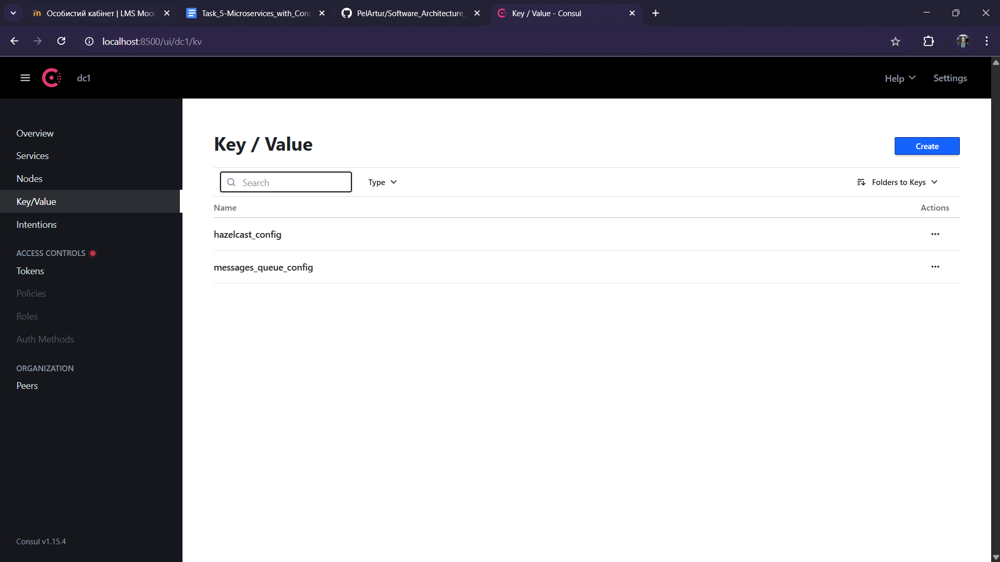

# Microservices with Consul

Author: Artur Pelcharskyi

## Getting Started

The laboratory work was performed and tested on the following configuration:

- **OS**: Windows 11
- **Python**: 3.10.0
- **Hazelcast**: 5.5.0
- **Hazelcast Management Center**: 5.5.0

Before running the Python scripts, install all required libraries:
```bash
pip install -r requirements.txt
```
**❗Warning!** In this work, Hazelcast clusters are launched from binary files. Therefore, before starting, ensure that all [hazelcast-5.5.0](https://hazelcast.com/community-edition-projects/downloads/) files are located in the same directory as this project. Additionally, replace the `hazelcast-5.5.0/config/hazelcast.xml` file with the one provided in this repository. The complete project structure should look like this:



## Changes

The functionality of the Messages Service has been updated, and as a result, the Facade Service has also undergone some changes. Now, the connection from the Facade to the Messages Service is organized through the Kafka Message Queue. Therefore, to begin, you should start the Kafka cluster using the following command:

```bash
docker-compose up -d
```

Additionally, a script has been created to automatically send messages to the Facade. It can be executed as follows:

```bash
python ./send_messages.py <num-of-messages>
```

This work includes three different runners:
1. `facade_runner.py`: Runs one instance each of **Facade Service**.
2. `logging_runner.py`: Starts one instance of the **Logging Service** and one Hazelcast cluster node. This script requires the port for the microservice to be passed as an argument. In this work, the default ports are **50051–50053**. The cluster nodes automatically assign their own ports.
3. `messages_runner.py`: Runs one instance of **Messages Service**.

The correct launch order is as follows:
```
python ./populate_data.py
```

After that in different terminals:

```
python ./facade_runner.py 8000
```

```
python ./logging_runner.py 50051
python ./logging_runner.py 50052
python ./logging_runner.py 50053
```

and

```
python ./messages_runner.py 51000
python ./messages_runner.py 51001
```

## Tasks

First, let's add the configuration data for **Hazelcast** and the **Messages queue**:

```
python ./populate_data.py
```

In **Consul**, we can verify that the necessary keys have been successfully added:


Now, let's start **1 instance** of the **Facade Service**, **3 instances** of the **Logging Service**, and **2 instances** of the **Messages Service**:


In **Consul**, we can see that the number of instances matches exactly the number of service instances we launched.

Let's send 10 messages and observe where they are routed:


Now, disable the **Logging Service** running on port `50052` and the **Messages Service** running on port `51000`.


Let's send 10 more messages and see how they are distributed now:


We observe that the second batches of messages were distributed between the **Logging Services** on ports `50051` and `50053`, while all messages were sent to the **Messages Service** on port `51001`. No messages were lost.

Additionally, in the first batch, the messages that were initially processed by **Logging Service** `50052` were redirected to **Logging Service** `50053`. Similarly, for the **Messages Service**: all messages that were initially handled by **Messages Service** `51000` were redirected to **Messages Service** `51001`.

Thus, I successfully integrated the Consul server into the system.

Consul correctly manages the running services, and I was able to significantly simplify the configuration script. It no longer contains hardcoded information about Hazelcast, the Messages Queue, service IP addresses, or ports. Instead, it only stores the keys required to access this data, which greatly simplifies and improves the maintainability of the code.
