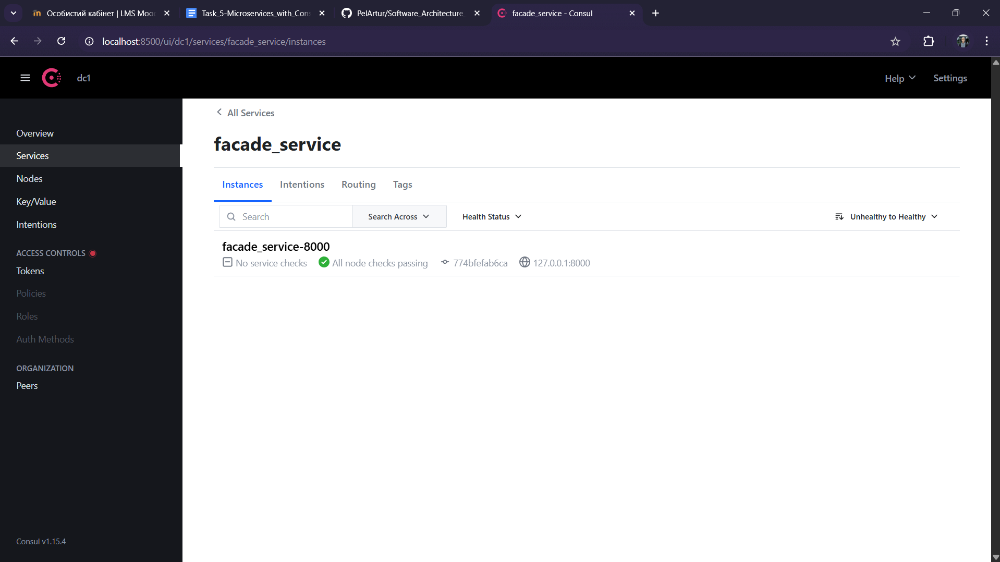

# Hazelcast

Author: Artur Pelcharskyi

Before running python scripts install all required libs:
```
pip install -r requirements.txt
```

## Tasks
### **1. Installing and configuring Hazelcast**
This lab utilizes Hazelcast 5.3.0 and Hazelcast Management Center 5.3.0 running in Docker. Below are the installed images:


### **2. Starting a cluster of three nodes**

**Creating new Docker Network command**
```
docker network create hazelcast-network
```

**Starting new nodes of cluster named `dev` commands:**
- node1
    ```
    docker run -it --name hz-node1 --network hazelcast-network --rm -e HZ_NETWORK_PUBLICADDRESS=172.18.0.1:5701 -e HZ_CLUSTERNAME=dev -p 5701:5701 hazelcast/hazelcast:5.3.0
    ```
- node2
    ```
    docker run -it --name hz-node2 --network hazelcast-network --rm -e HZ_NETWORK_PUBLICADDRESS=172.18.0.1:5702 -e HZ_CLUSTERNAME=dev -p 5702:5701 hazelcast/hazelcast:5.3.0
    ```
- node3 
    ```
    docker run -it --name hz-node3 --network hazelcast-network --rm -e HZ_NETWORK_PUBLICADDRESS=172.18.0.1:5703 -e HZ_CLUSTERNAME=dev -p 5703:5701 hazelcast/hazelcast:5.3.0
    ```


**Hazelcast Management Center**

```
docker run -d -p 8080:8080 --name hz-mancenter --network hazelcast-network -e HZ_CLUSTERNAME=dev hazelcast/management-center:5.3.0
```

From the `hz-node3` terminal, you can see that the three-node cluster has been successfully created.


The same result is reflected in the Management Center:


### **3. Distributed Map**

By running the `demo_map.py` script, 1000 new entries will be added to the system simultaneously. In the Management Center, we will observe the following resource distribution:


We can see that the entries were divided approximately equally among the nodes. However, the data was recorded(Puts) through a single node because the operation was performed as one batch rather than multiple individual operations.

#### **3a. Disabling of one node**

Let’s check the distribution after disabling `hz-node3`:


As we can see, the data has now been redistributed between `hz-node1` and `hz-node2`, with no data loss occurring.

#### **3b. Disabling of two nodes sequentially**

Now, let’s disable `hz-node2` after having previously disabled `hz-node3` in the earlier experiment:


Once again, no data loss occurred, and all entries are now stored in `hz-node1`.

#### **3c. Disabling of two nodes simultaneously**

After disabling `hz-node2` and `hz-node3` simultaneously:


This time, some data was lost. It is likely that all the lost data was stored on one of the disabled nodes, as replication was only able to preserve the data from one node on `hz-node1`.

#### **3d. How to prevent data loss?**
To prevent data loss in Hazelcast, you can adjust certain settings of the data structures. One option is to modify the number of backups. In the `config/hazelcast.xml` file, you can change the following value:

```xml
<hazelcast>
    <map name="my-distributed-map">
        <backup-count>1</backup-count>
    </map>
</hazelcast>
```

When using 3 nodes, as in our case, this value should be set to 2. Since the default value was 1, the backup for `hz-node2` was stored on `hz-node1`, and the backup for `hz-node3` was stored on `hz-node2`. As a result, the data from `hz-node3` was lost because both the node itself and its backup node(`hz-node2`) were disabled. However, the data from `hz-node2` was preserved on `hz-node1`. By setting the number of backups to 2, each node would have backups on the other two nodes, ensuring that all data could be preserved on `hz-node1` even in such a scenario.


### **4. Distributed Map without locks**

Using `no_lock.py`, three clients are launched. Each client retrieves the value of the key "key", increments it by 1, and writes the result back. There are 3 such clients, and each performs 10,000 iterations. After execution, the following results were obtained:


Also, in the Management Center:



We observe that the final value is 13188, despite the expected value of 30000. At the same time, we can see that 30000 operations were performed:


During this experiment, a classic multi-threaded/multi-process error occurred — a data race. This happens when one client reads the value before another client writes it back, causing the current client to overwrite the previous result with its own.


<!-- ```
docker run -d --name hz-node1 --network hazelcast-network -e HZ_CLUSTERNAME=dev -e HZ_NETWORK_PUBLICADDRESS=172.18.0.1:5701 -p 5701:5701 hazelcast/hazelcast:5.3.0
```

```
docker run -d --name hz-node2 --network hazelcast-network -e HZ_CLUSTERNAME=dev -e HZ_NETWORK_PUBLICADDRESS=172.18.0.1:5702 -p 5702:5701 hazelcast/hazelcast:5.3.0
```

```
docker run -d --name hz-node3 --network hazelcast-network -e HZ_CLUSTERNAME=dev -e HZ_NETWORK_PUBLICADDRESS=172.18.0.1:5703 -p 5703:5701 hazelcast/hazelcast:5.3.0
``` -->

