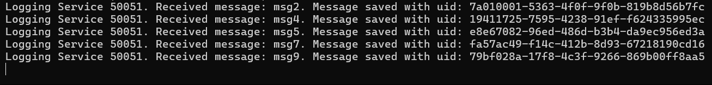
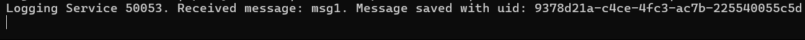

<<<<<<< HEAD
# Microservices with Hazelcast Distributed Map
=======
# Microservices Basics

## Content
Three services are implemented here, each with a corresponding port:

- Facade service (8000)
- Messages service (8001)
- Messages service (50051)

The implementation code for each service is located in its corresponding folder.

There is also a script that starts all services: `runner.py`.

```
python runner.py
```

Both additional tasks have been implemented:

- Use of gRPC for interaction between services
- Availability of the retry mechanism

## Installations
Python: 3.10+

```
pip install -requirements.txt
```

<!-- ```bash
python -m grpc_tools.protoc -I. --python_out=. --grpc_python_out=. logging.proto
``` -->

## Demonstration

### Post




### Get


### Terminal Ouput



### Retry


>>>>>>> fe03f4f30059d13ae9cc34183a3fc4e873ba889a
