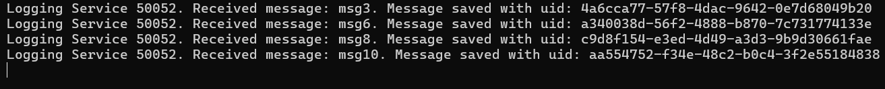
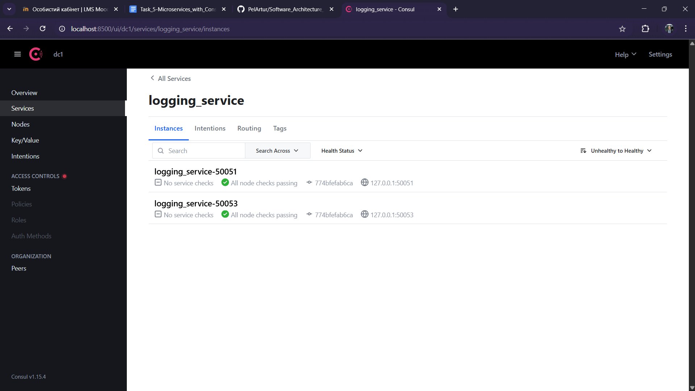
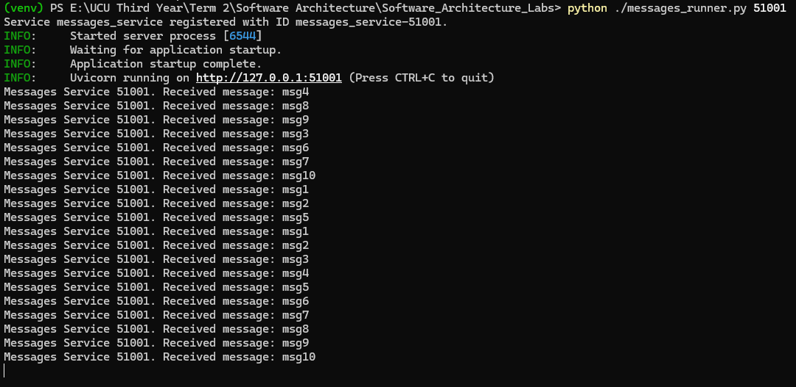

# Microservices with Kafka Message Queue

Author: Artur Pelcharskyi

## Getting Started

The laboratory work was performed and tested on the following configuration:

- **OS**: Windows 11
- **Python**: 3.10.0
- **Hazelcast**: 5.5.0
- **Hazelcast Management Center**: 5.5.0

Before running the Python scripts, install all required libraries:
```bash
pip install -r requirements.txt
```
**❗Warning!** In this work, Hazelcast clusters are launched from binary files. Therefore, before starting, ensure that all [hazelcast-5.5.0](https://hazelcast.com/community-edition-projects/downloads/) files are located in the same directory as this project. Additionally, replace the `hazelcast-5.5.0/config/hazelcast.xml` file with the one provided in this repository. The complete project structure should look like this:


## Changes

The functionality of the Messages Service has been updated, and as a result, the Facade Service has also undergone some changes. Now, the connection from the Facade to the Messages Service is organized through the Kafka Message Queue. Therefore, to begin, you should start the Kafka cluster using the following command:

```bash
docker-compose up -d
```

Additionally, a script has been created to automatically send messages to the Facade. It can be executed as follows:

```bash
python ./send_messages.py <num-of-messages>
```

This work includes three different runners:
1. `ms-runner.py`: Runs one instance each of two services — **Facade Service**  and **Client Server**.
2. `logging-runner.py`: Starts one instance of the **Logging Service** and one Hazelcast cluster node. This script requires the port for the microservice to be passed as an argument. In this work, the default ports are **50051–50053**. The cluster nodes automatically assign their own ports.
3. `messages_runner.py`: Runs one instance of **Messages Service**.

The correct launch order is as follows:
```
python ./ms_runner.py
```

After that in different terminals:

```
python ./logging_runner.py 50051
python ./logging_runner.py 50052
python ./logging_runner.py 50053
```

and

```
python ./messages_runner.py 51000
python ./messages_runner.py 51001
```

## Tasks

### Task 1

First, let’s start all the services and check whether they have registered with the Config Server:


We can see that 3 instances of the **Logging Service** and 2 instances of the **Messages Service** have been successfully launched. Now, let’s send 10 messages to the **Facade Service **and observe the distribution of messages between the microservices:

**Logging Service**





**Messages Service**


Additionally, the GET request returns different results depending on which instance of the **Messages Service** is selected:


Therefore, we can conclude that all services are functioning correctly, sharing input data among themselves without any loss under standard conditions.

### Task 2

Now, we will not start the **Messages Service** and will send 100 messages:



After sending 100 messages, we will exclude one of the brokers. According to the task condition, this should be the leader, so let's first identify it via the UI:


The leader is the broker with ID 1. Now, let's locate its Docker container and disable it:


Finally, let's verify through the UI that broker 1 has been removed and a new leader has been elected:


Now, let's start the two instances of the Messages Service and observe the results they produce:



As a result, it was possible to read the messages even after losing one broker. In this case, the first instance of the Messages Service read more messages because it was started a little earlier. The image might not display the log clearly, so I’ve also moved it to `ms_out1.txt` and `ms_out2.txt`. Additionally, you can observe that the order of the read messages is slightly different, but a potential reason for this is how the messages are distributed across the partitions.


