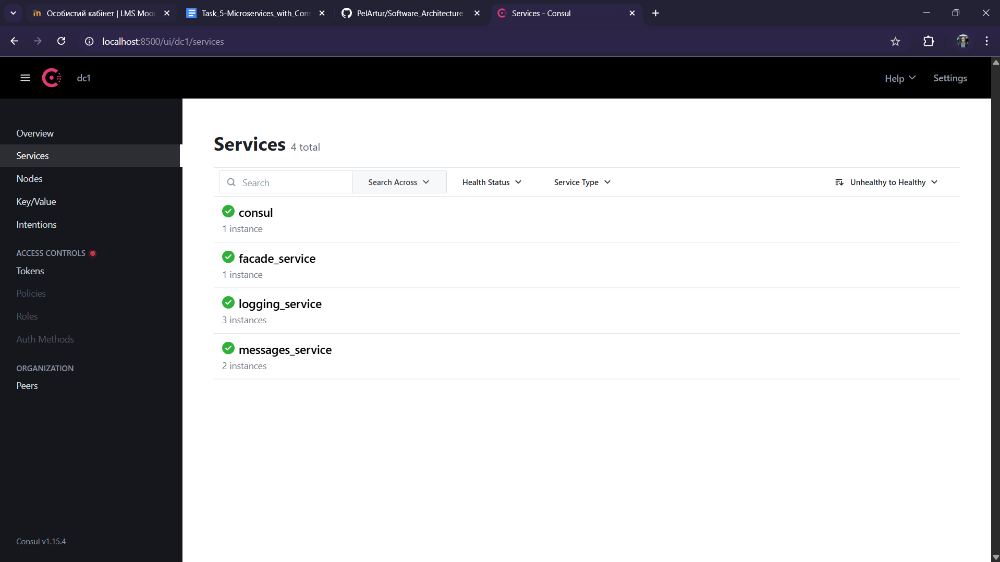
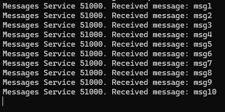

# Microservices with Hazelcast Distributed Map

Author: Artur Pelcharskyi

## Getting Started

The laboratory work was performed and tested on the following configuration:

- **OS**: Windows 11
- **Python**: 3.10.0
- **Hazelcast**: 5.5.0
- **Hazelcast Management Center**: 5.5.0

Before running the Python scripts, install all required libraries:
```
pip install -r requirements.txt
```
**❗Warning!** In this work, Hazelcast clusters are launched from binary files instead of Docker containers, as was done in the previous work. Therefore, before starting, ensure that all [hazelcast-5.5.0](https://hazelcast.com/community-edition-projects/downloads/) files are located in the same directory as this project. Additionally, replace the `hazelcast-5.5.0/config/hazelcast.xml` file with the one provided in this repository. The complete project structure should look like this:


## Changes

A new service has been added: the **Config Server**, which dynamically stores the IP addresses of microservices. In the current version, these include the **Logging Service** and the **Messages Service**. Since the Messages Service does not yet have any functionality and is always launched as a single instance, the Config Server stores a static IP address for this service, which remains unchanged throughout its operation. For the Logging Service, IP addresses are added when a new instance of the service is launched and removed when the service is shut down. As a result, the Config Server only stores the IP addresses of active Logging Service instances.

This work includes two different runners:
1. `ms-runner.py`: Runs one instance each of three services — **Facade Service**, **Messages Service**, and **Client Server**.
2. `logging-runner.py`: Starts one instance of the **Logging Service** and one Hazelcast cluster node. This script requires the port for the microservice to be passed as an argument. In this work, the default ports are **50051–50053**. The cluster nodes automatically assign their own ports.

The correct launch order is as follows:
```
python ./ms_runner.py
```

After that in different terminals:

```
python ./logging_runner.py 50051
python ./logging_runner.py 50052
python ./logging_runner.py 50053
```

## Tasks



We can observe that after running all the scripts, the IP addresses of all three Logging Services have been successfully added to the Config Server.

Now, using Postman, we will add 10 messages:


Let’s review the logs of each Logging Service:




We can observe that the messages were added through different instances of the Logging Service. Now, let’s check the result when we request to retrieve all the messages:


So, we successfully retrieved all 10 messages, which were sent via the Logging Service running on port 50051. Now, let’s disable the Logging Services on ports 50051 and 50053 and verify whether we can still obtain the same result.


Once again, we obtained exactly the same result, albeit with the messages in a different order. Below, you can verify that the Logging Service instances were disabled, their IP addresses were removed from the Config Server, and that the `Get` request was successfully processed through the Logging Service running on port 50052:


